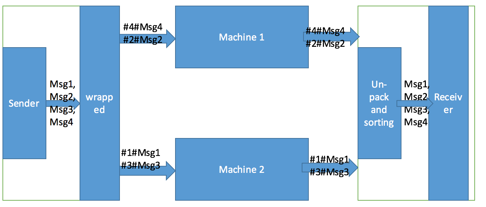

# OrderedMessageQueue
Refer to https://yq.aliyun.com/articles/116.
## Problem
The queue of Alibaba's [MNS](https://help.aliyun.com/document_detail/27414.html) (message service) will be duplicated three copies. Due to the distributed feature, it cannot support the `FIFO` (first in and first out).

We assume that there is only single sender (producer) and single receiver (consumer).

## Solution
- Message will be wrapped when sent. To be specific, add the `SeqId` (e.g., #num#)
- Message will be un-packed when received, and sorted.



## Use of code
- Create a file named `.aliyun-mns.properties` in user home directory which is `~/` in Linux or `C:\Users\YOURNAME\` in Windows.
- Fill the file with your Access Key ID, Secret Access Key, Account Id and Account Endpoint.

```
mns.accountendpoint=xxx
mns.accesskeyid=xxx
mns.accesskeysecret=xxx
```
Be sure that `Java 1.8` is available.

`OrderedQueueWrapper.java` is key to maintain message strict ordered.

```java
OrderedQueueWrapper orderedMQ = new OrderedQueueWrapper(queue);
```
### send
```java
for (int i = 1; i < 20; i++) {
    Message message = new Message();
    message.setMessageBody("i am message " + i);
    orderedMQ.sendMessageInOrder(message);
}
```
### receive
```java
for (int i = 1; i < 20; i++) {
    Message popMsg = orderedMQ.receiveMessageInOrder();
    if (popMsg != null) {
        System.out.println(popMsg.getMessageBody());
    }
}
orderedMQ.delete();
```

## Fail cases
Currently, this solution doesn't care about the failure cases of both sender and receiver.

If we consider either sender side or receiver side encounters failure, we shall persist the `SeqId` into storage (e.g., disk or database).

### One more thing
The new `OrderedQueueWrapper` API doesn't need to delete message in client code, which is not consisted with original API. We delete the message earlier, such that the receiver side won't receive duplicated message. (Of course, this is also under the hypothesis that no failure happens).

We have two methods to handle it:
- Add a daemon thread to update the queue's `Visibility_TimeOut` when necessary
- Set the queue's `Visibility_TimeOut` large enough
